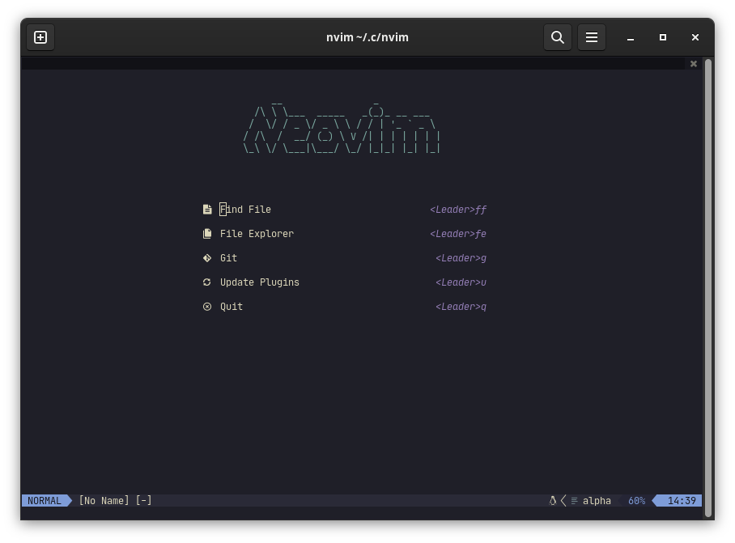

# ~/.config/nvim



## Requirements

- A terminal with a patched font installed, like [Kitty](https://github.com/kovidgoyal/kitty)
- A C compiler, like [GCC](https://gcc.gnu.org/)
- [bat](https://github.com/sharkdp/bat)
- [fd](https://github.com/sharkdp/fd)
- [ripgrep](https://github.com/BurntSushi/ripgrep)
- [gitui](https://github.com/extrawurst/gitui)

### Arch Linux

```bash
paru -S gcc bat fd ripgrep gitui
```

### Fedora

```bash
sudo dnf install gcc-c++ bat rust-fd-find ripgrep gitui
```

### Additional config

- [Kitty](/.config/kitty)
